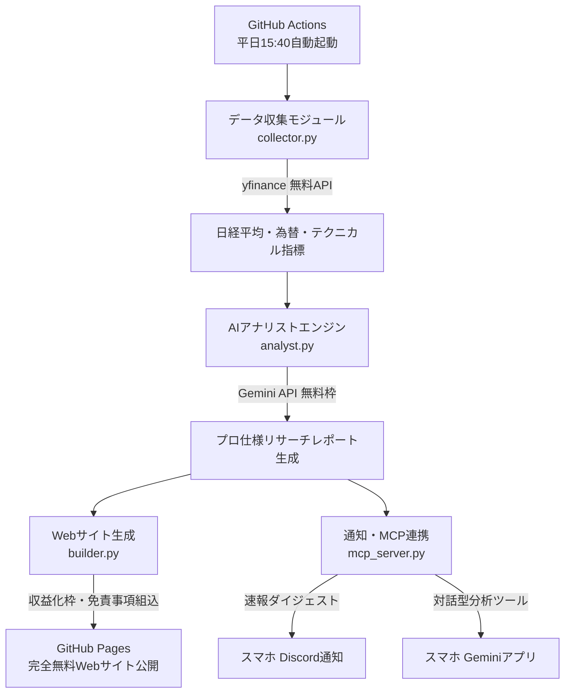

# 日本株AIアナリストレポート自動生成・Web公開・収益化システム 実装計画

日本株（日経平均、TOPIX、ドル円、主要セクター・個別株）の市場データを完全無料で自動収集し、Google Gemini を活用してプロ証券アナリスト水準の詳細なリサーチレポート（テクニカル分析、マクロ要因、明日以降のシナリオ予測）を毎日自動生成します。
生成されたレポートは、広告枠や金融アフィリエイト導線を備えた美しいWebサイトとして自動公開され、スマホ通知（Discord）およびスマホGeminiからのMCP対話にも対応します。
初期費用・サーバー代・API費用すべて0円で、古いPCでもブラウザ（GitHub Codespaces）から完全自動化できます。

## ユーザー確認事項 (User Review Required)

> [!IMPORTANT]
> **収益化（マネタイズ）の仕組みについて**
> 1. **広告収入（Google AdSense等）**: 自動生成されたWebレポートのヘッダー・記事中・フッターに広告プレースホルダーを設置します。審査通過後に広告コードを差し替えるだけで収益化が可能です。
> 2. **金融アフィリエイト（高単価）**: ネット証券会社（SBI証券、楽天証券等）の口座開設紹介リンクや、テクニカル分析ツールの紹介バナー枠を配置します（A8.net等のASPから取得したリンクを配置可能）。
> 3. **免責事項（重要）**: 株式情報の発信には「投資勧誘ではなく情報提供を目的とする旨」の免責事項の自動記載が法律上必須となります。システムが自動でレポート末尾に記載します。

## 全体アーキテクチャ

## 実装計画と変更点

### 1. データ収集・テクニカル指標計算 (`collector.py`)
- `yfinance` を利用して以下のデータを一括取得（APIキー不要・完全無料）：
  - 主要指数: 日経平均 (`^N225`)、TOPIX、東証グロース250
  - 為替・海外市況: ドル円 (`JPY=X`)、米10年債利回り、米S&P500、SOX半導体指数
  - 個別注目銘柄: トヨタ、レーザーテック、三菱UFJなど
- テクニカル指標の自動計算:
  - 5日・25日・75日移動平均線 (SMA) および乖離率
  - RSI (14日)
  - MACD (12, 26, 9) およびシグナル線
  - ボリンジャーバンド (20日, ±2σ)
  - 出来高変化率

### 2. Geminiプロンプト・レポート生成エンジン (`analyst.py`)
- シニアエクイティリサーチアナリストの役割定義（プロンプトエンジニアリング）。
- レポート構造:
  1. エグゼクティブ・サマリー（投資スタンス、要点3点）
  2. 主要市場データ一覧表
  3. マクロ・為替・海外市場要因の分析
  4. クオンツ・テクニカル分析（オシレーター、バンド、重要価格帯）
  5. セクター・主要銘柄動向
  6. 明日〜今週のシナリオ予想（メインシナリオ・リスクシナリオ・想定レンジ）
  7. 明日以降の注目カタリスト・経済スケジュール
  8. アナリストの投資戦略メモ＆免責事項

### 3. 収益化対応レスポンシブWebジェネレーター (`builder.py`)
- 信頼感と視認性の高い投資リサーチハウス風デザイン（モダンUI・ダークモード対応）。
- マネタイズ導線:
  - レポート上部・下部の広告枠（Google AdSense用スロット）
  - 「おすすめ証券口座」「投資入門書籍」のアフィリエイト枠
  - 過去レポートの自動アーカイブ・ナビゲーション機能
- 静的HTMLとして出力（GitHub Pagesでホスティング可能）。

### 4. スマホ通知＆MCPサーバー (`mcp_server.py`)
- 大引け後のサマリー速報と新着記事URLをDiscord Webhookでスマホにプッシュ通知。
- FastMCPサーバーにより、スマホのGeminiアプリから「本日の日経平均のテクニカル分析を教えて」「〇〇銘柄を分析して」と直接呼び出せるツールを提供。

### 5. GitHub Actions 自動化ワークフロー (`.github/workflows/daily_report.yml`)
- 平日 15:40（東証大引け後）に自動実行。
- データの取得 → Geminiでレポート生成 → HTMLビルド → GitHub Pagesへ自動デプロイ → Discord通知までを完全自動で処理。

## 検証計画 (Verification Plan)

### 1. データ取得とテクニカル計算の検証
- `collector.py` を実行し、日経平均および為替の最新値、移動平均、RSI、MACDが正しく算出されることを確認。

### 2. レポート生成の品質検証
- `analyst.py` を実行し、Gemini APIから本格的で矛盾のない証券アナリストレポートが生成されることを確認。

### 3. Webサイト生成と収益化枠の検証
- `builder.py` を実行して生成されたHTMLをローカルで開き、レイアウト、レスポンシブ表示（スマホ/PC）、広告・アフィリエイト枠の配置を確認。

### 4. 自動化と通知の検証
- Discordへの通知送信テスト、およびGitHub Actionsワークフロー構文の確認。
